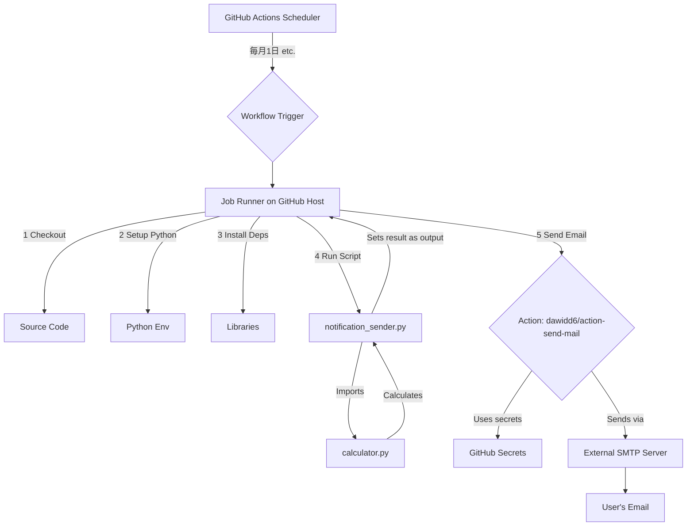

# 詳細設計書：機能7 - 月次投資額自動通知機能

**バージョン**: 1.0  
**作成日**: 2025年9月2日  
**作成者**: Gemini

---

## 1. 概要

本ドキュメントは、機能要件定義書 `07_Monthly_Notification_Feature.md` に基づき、「月次投資額自動通知機能」の実装に関する技術的な詳細を定義する。

## 2. アーキテクチャ概要

本機能は、GitHub Actionsを中核としたサーバーレスアーキテクチャを採用する。全体の処理フローは以下の通り。

1.  **スケジューラ**: GitHub Actionsの`schedule`機能が、定義された日時にワークフローをトリガーする。
2.  **実行環境**: GitHubホストのランナー（仮想マシン）上で、Python実行環境がセットアップされる。
3.  **計算処理**: リポジトリ内のPythonスクリプトが実行され、`AAVC_calculate_tool`の既存ロジックを用いて投資額を算出する。
4.  **通知処理**: 計算結果を本文に含んだEメールが、外部のSMTPサーバーを介して指定の宛先に送信される。



## 3. コンポーネント詳細設計

本機能は、主に2つの新しいファイルを作成することで実現する。

### 3.1. GitHub Actions ワークフロー

-   **ファイルパス**: `.github/workflows/monthly_notification.yml`
-   **目的**: 自動実行のスケジュール定義と、実行ステップ全体のオーケストレーション。
-   **実装詳細**:

    ```yaml
    name: Monthly Investment Notification

    on:
      # 毎月1日のUTC 0時0分（日本時間午前9時）に実行
      schedule:
        - cron: '0 0 1 * *'
      # 手動実行も可能にする (テスト用)
      workflow_dispatch:

    jobs:
      build-and-notify:
        runs-on: ubuntu-latest
        steps:
          - name: Checkout repository
            uses: actions/checkout@v4

          - name: Set up Python
            uses: actions/setup-python@v5
            with:
              python-version: '3.11'

          - name: Install dependencies
            run: |
              python -m pip install --upgrade pip
              pip install -r requirements.txt

          - name: Run calculation script
            id: calculate
            run: python src/AAVC_calculate_tool/notification_sender.py

          - name: Send mail
            uses: dawidd6/action-send-mail@v3
            with:
              server_address: ${{ secrets.MAIL_SERVER }}
              server_port: ${{ secrets.MAIL_PORT }}
              username: ${{ secrets.MAIL_USERNAME }}
              password: ${{ secrets.MAIL_PASSWORD }}
              subject: '【月次投資額通知】AAVC自動計算レポート'
              body: ${{ steps.calculate.outputs.notification_body }}
              to: ${{ secrets.MAIL_TO }}
              from: AAVC Calculate Tool
    ```

### 3.2. 計算・通知用Pythonスクリプト

-   **ファイルパス**: `src/AAVC_calculate_tool/notification_sender.py`
-   **目的**: 投資額の計算を実行し、その結果を後続のGitHub Actionsステップで利用可能な形式で出力する。
-   **実装詳細**:

    ```python
    import os
    from datetime import datetime
    from AAVC_calculate_tool.calculator import AAVCCalculator
    from AAVC_calculate_tool.data_loader import DataLoader

    # ---
    # 設定項目
    # ---
    TICKER = "SPY"       # 計算対象のティッカー
    AMOUNT = 40000       # 基準投資額
    # ---------------

    def main():
        """メイン処理"""
        print(f"Running calculation for {TICKER}...")
        data_loader = DataLoader()
        calculator = AAVCCalculator(data_loader=data_loader)

        # AAVC計算の実行
        result = calculator.calculate(TICKER, AMOUNT)
        
        # 結果の取得
        # resultオブジェクトの構造を仮定。要確認・調整。
        # 例：result = {"ticker": "SPY", "aavc_purchase_price": 123.45, ...}
        # 実際のresultオブジェクトのキーに合わせて修正が必要です。
        purchase_price = result.get("aavc_purchase_price", "N/A")
        last_close = result.get("last_close_price", "N/A")

        # 通知メッセージの作成
        today = datetime.utcnow().strftime('%Y-%m-%d')
        message = (
            f"日付: {today}\n"
            f"銘柄: {TICKER}\n"
            f"基準投資額: ${AMOUNT:,.2f}\n"
            f"--------------------
            "
            f"最新終値: ${last_close:,.2f}\n"
            f"AAVC購入推奨額: ${purchase_price:,.2f}\n"
        )

        # 結果をGitHub Actionsの出力として設定
        # 'body'という名前で出力に設定
        print(f"::set-output name=notification_body::{message}")
        print("Notification body prepared.")

    if __name__ == "__main__":
        main()

    ```

### 3.3. 設定と機密情報管理

-   **リポジトリ設定**: GitHubリポジトリの `Settings > Secrets and variables > Actions` に、以下のSecretを登録する必要がある。
    -   `MAIL_SERVER`: (例: `smtp.gmail.com`)
    -   `MAIL_PORT`: (例: `587`)
    -   `MAIL_USERNAME`: (例: `your_email@gmail.com`)
    -   `MAIL_PASSWORD`: (Gmailの場合、アプリパスワードを推奨)
    -   `MAIL_TO`: 通知を受け取るメールアドレス

-   **スクリプト内設定**: 計算対象の銘柄（`TICKER`）と基準額（`AMOUNT`）は、`notification_sender.py`スクリプトの先頭部分で直接編集する。

## 4. テスト計画

1.  **単体テスト**: `notification_sender.py`が正しく計算を実行し、期待通りのフォーマットでメッセージを出力することを確認する（ローカルで実行）。
2.  **結合テスト**: `workflow_dispatch`トリガーを用いてGitHub Actionsワークフローを手動で実行し、実際にEメールが送信され、内容が正しいことを確認する。
